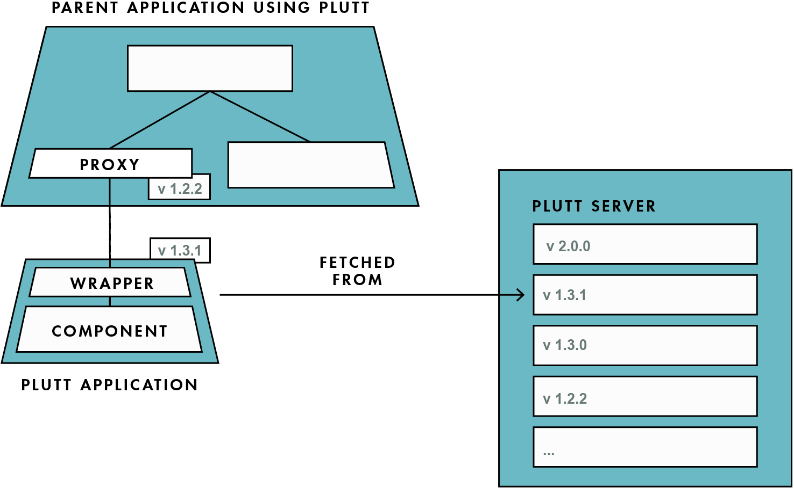

<p align="center">
  
</p>

<!-- prettier-ignore-start -->
Plutt: Safe micro frontends without the hassle
==============================================
<!-- prettier-ignore-end -->

[](https://npmjs.org/package/@digitalroute/plutt)
[](https://npmjs.org/package/@digitalroute/plutt)
[](https://github.com/digitalroute/plutt/blob/master/package.json)

<!-- toc -->
* [🗒 Description](#-description)
* [✨ Features](#-features)
* [🏗 Usage](#-usage)
* [📚 Examples](#-examples)
* [🔍 How Plutt Works](#-how-plutt-works)
* [🔨 Commands](#-commands)
* [🐢 Learn More](#-learn-more)
<!-- tocstop -->

# 🗒 Description

Plutt is a build tool that enables developers to generate micro frontends from framework-native components and to serve them version safely. The micro frontends are automatically safe to use in production if they work during development.

# ✨ Features

- **Access transparency:** Consuming applications use the micro frontends as regular components, without having to know that it is a micro frontend.
- **Automatic Version Safety:** At run-time Plutt will always upgrade to the latest version of a micro frontend, as long as it is non-breaking. This is done by supporting lock-step deployments.
- **Framework Agnostic:** Plutt applications can be consumed by any framework. Currently Plutt supports React and Vue, but it is easy to extend Plutt to support more frameworks.
- **Type Safety:** Micro frontends can be consumed with type safety. Any props that are used incorrectly can be found at compile-time.

# 🏗 Usage

<!-- usage -->
```sh-session
$ npm install -g @digitalroute/plutt
$ plutt COMMAND
running command...
$ plutt (-v|--version|version)
@digitalroute/plutt/0.0.0-semantically-released darwin-x64 node-v13.10.1
$ plutt --help [COMMAND]
USAGE
  $ plutt COMMAND
...
```
<!-- usagestop -->

# 📚 Examples

All examples are located at [Plutt Examples Collection](https://github.com/juliuscc/plutt-examples-collection).

# 🔍 How Plutt Works

Plutt is a build tool that enables developers to generate micro frontends from framework-native components and to serve them version safely. Plutt takes a framework-native component as input and outputs two types of artifacts: a _Plutt Application_ (composed of the original Component and a _Wrapper_) and a _Proxy_. To serve Plutt applications, Plutt provides a _Plutt Server_.

You can use only a Plutt Application, but to get most benefits you should use the provided Proxy and Plutt Server.



## Plutt Application

A Plutt application is a self-contained micro frontend application that exposes functions for mounting with properties, updating the properties, and unmounting. Plutt applications are stored on a Plutt server and accessed in run-time, to ensure that the latest version is consumed.

## Proxy

A proxy is a framework-native component that knows how to fetch and mount a corresponding Plutt application. Plutt generates one proxy per supported framework, which currently is React and Vue. Proxies integrate into a parent application during compile-time. Proxies do not include any business logic, but they do include everything required to safely consume a Plutt application. Proxies fetch a specific version of a Plutt application which can be verified at compile-time to be non-breaking. If the Plutt application is typed, the proxy is also typed, and static analysis can be used to indicate if a Plutt application is integrated correctly.

## Plutt Server

Plutt applications are stored on a Plutt server, which is where dependents fetch Plutt applications from. Plutt server upgrade requests to Plutt applications so that dependents receive the latest non-breaking version. Semantic versioning is used to ensure that the upgraded version is non-breaking. This way, the team that provides a micro frontend is responsible for deciding when to update to production, while ensuring that updates do not break dependent applications. Dependent teams own the decision of when to upgrade breaking versions. Plutt server provides every team with the correct responsibilities that facilitate independent deployments.

# 🔨 Commands

<!-- commands -->
* [`plutt build`](#plutt-build)
* [`plutt help [COMMAND]`](#plutt-help-command)
* [`plutt serve [DIRECTORY]`](#plutt-serve-directory)

## `plutt build`

Build a plutt app.

```
USAGE
  $ plutt build

OPTIONS
  -s, --sourceDirectory=sourceDirectory  [default: src] Source directory for the plutt app.
  -v, --verbose                          Prints extra information. Useful for debuging.

DESCRIPTION
  Build a plutt app.

  Make sure that there exists a src/ directory with an index.js.
```

## `plutt help [COMMAND]`

display help for plutt

```
USAGE
  $ plutt help [COMMAND]

ARGUMENTS
  COMMAND  command to show help for

OPTIONS
  --all  see all commands in CLI
```

_See code: [@oclif/plugin-help](https://github.com/oclif/plugin-help/blob/v2.2.3/src/commands/help.ts)_

## `plutt serve [DIRECTORY]`

Serve a plutt app.

```
USAGE
  $ plutt serve [DIRECTORY]

ARGUMENTS
  DIRECTORY  [default: .] Directory to serve plutt apps from

OPTIONS
  -p, --port=port  [default: 5000] Port used to serve plutt app
```
<!-- commandsstop -->

# 🐢 Learn More

This project is developed together with a thesis, that will finish this summer. When the thesis is published a link to the thesis will be available here to learn more about Plutt.
